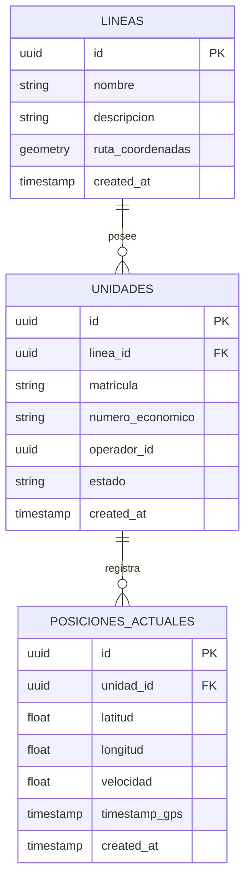
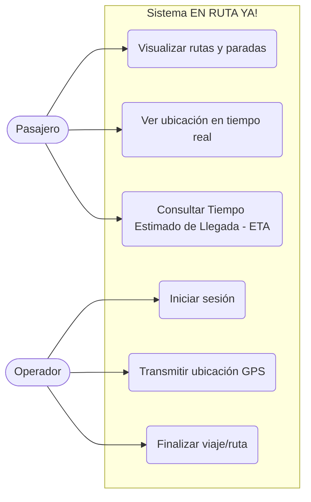
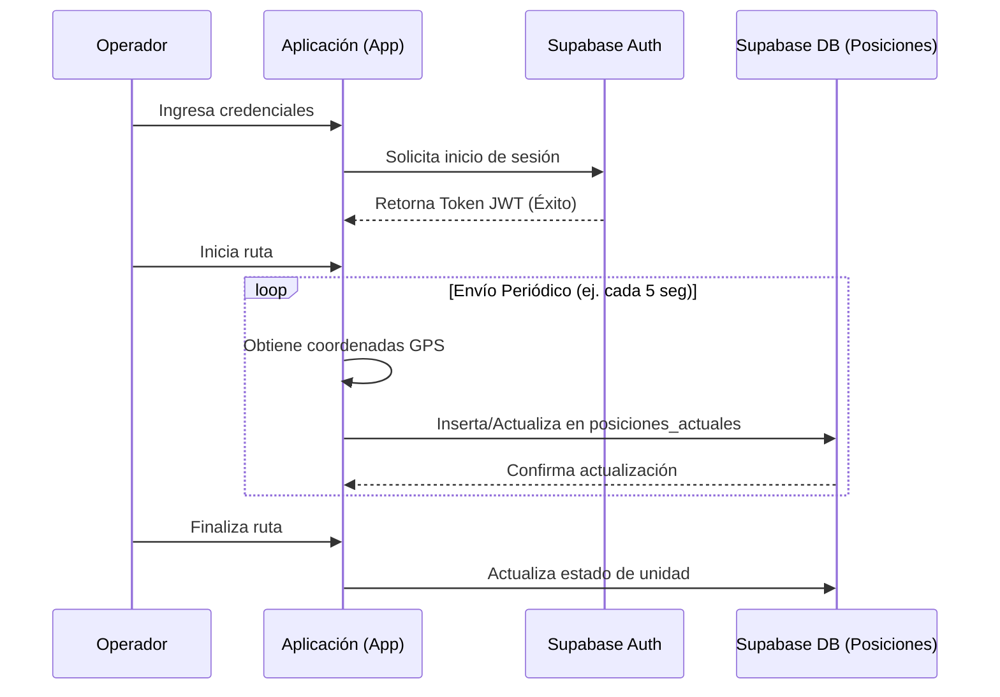
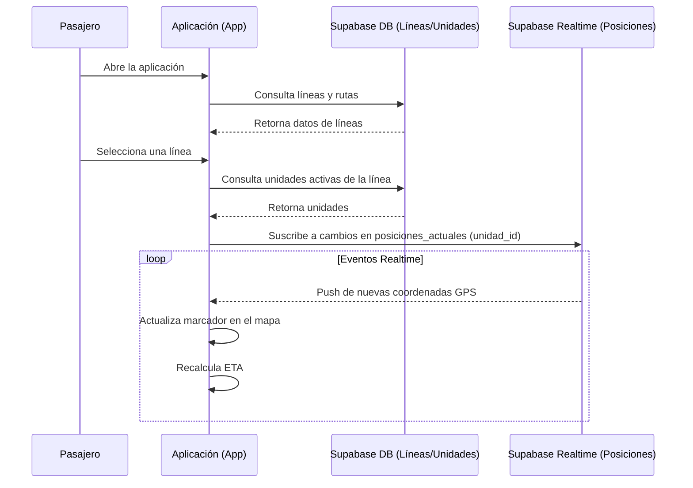

# Documentación Técnica: EN RUTA YA!

Este documento describe la arquitectura, diseño de base de datos, casos de uso y flujos principales del sistema EN RUTA YA!.

## 1. Diagrama de Arquitectura

El sistema está compuesto por una aplicación cliente (móvil/web) que interactúa con servicios de backend en Supabase y mapas base.

```mermaid
graph TD
    subgraph Cliente ["Cliente (Pasajero / Operador)"]
        A[Aplicación Web/Móvil]
        B[Geolocalización GPS]
    end

    subgraph Backend ["Supabase (PostgreSQL / Auth / Realtime)"]
        C[API REST / GraphQL]
        D[(Base de Datos PostgreSQL)]
        E[Autenticación]
        F[Canales Realtime]
    end

    subgraph Servicios Externos
        G[Mapas (Mapbox / OSM)]
    end

    A -->|Autenticación y Consultas| C
    A -->|Login| E
    B -->|Envío de Coordenadas| C
    A <-->|Suscripción GPS y ETA| F
    C --> D
    E --> D
    F --> D
    A -->|Carga de Mapas| G
```

## 2. Diagrama de Entidad-Relación (ERD)

El modelo de datos gestionado en Supabase (PostgreSQL) centraliza la información de las rutas (líneas), los vehículos (unidades) y su seguimiento en tiempo real.



## 3. Diagrama de Casos de Uso

Los principales actores del sistema son el Pasajero (usuario final) y el Operador (conductor del microbús).



## 4. Diagramas de Secuencia

### 4.a Login de Operador y envío de GPS

Este flujo describe cómo un operador inicia sesión y la aplicación comienza a transmitir sus coordenadas hacia Supabase.



### 4.b Pasajero visualizando rutas y ETA

Este flujo muestra cómo el pasajero obtiene la información de las unidades y se suscribe a sus actualizaciones en tiempo real.


